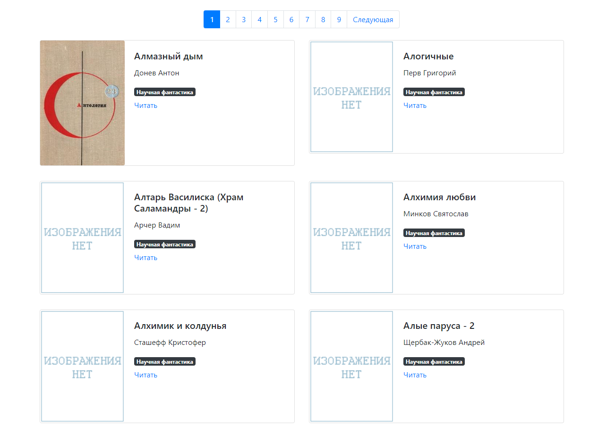

# Парсер книг с сайта [tululu.org](https://tululu.org)


Данный проект создает отдельный сайт с книгами, скачанными из библиотеки
с помощью https://github.com/ArtemZinukov/parsing_online_library

## Как установить

Python3 должен быть уже установлен. Затем используйте pip (или pip3, если есть конфликт с Python2) для установки зависимостей:

```pip install -r requirements.txt```

## Как запустить скрипт

Для того, чтобы запустить сайт, необходимо прописать команду в терминал:

```python render_website.py ```

Вы также можете указать путь к файлу json, для того, чтобы использовать, необходимо прописать команду:

```python render_website.py --dest_folder ваш путь к файлу```

по стандарту путь вот такой: "media/books_info.json".

## Рабочий сайт

После запуска скрипта перейти по ссылке http://127.0.0.1:5500/pages/index3.html

Выглядит вот так:


Ссылка на сайт для примера: [страница сайта на Github Pages](https://artemzinukov.github.io/library.github.io/pages/index2.html)


Также при необходимости вы можете воспользоваться сайтом, открыв его у себя на компьютере,
файлы находятся в папке pages вашего проекта с названиями index1.html - indexn.html, где n - число страниц.

## Цель проекта

Код написан в образовательных целях на онлайн-курсе для веб-разработчиков [dvmn.org](https://dvmn.org).